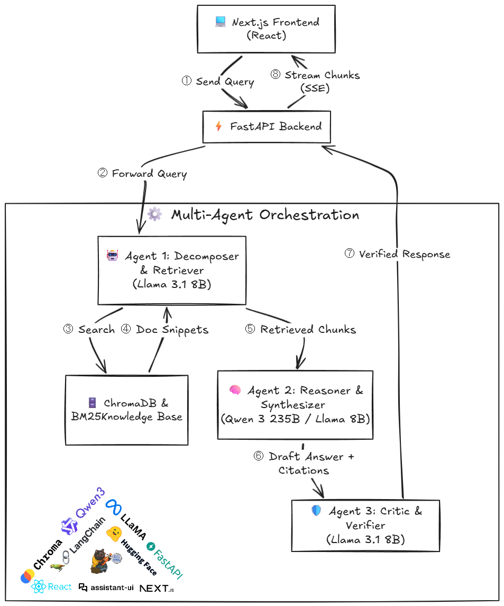

<p align="center">
  
</p>

<h1 align="center">Multi-Agent RAG — AI in Healthcare</h1>

<p align="center">
  <strong> An agentic Retrieval-Augmented Generation system on a healthcare AI knowledge base. Three specialized agents work together to classify queries, retrieve relevant context through hybrid search, generate cited answers with chain-of-thought reasoning, and verify every citation before presenting results. The system includes a modern React frontend that streams agent activity in real-time.</strong>
</p>

<p align="center">
  <a href="#-setup--installation">Quick Start</a> •
  <a href="#-how-it-works">How it works</a> •
  <a href="#-architecture">Architecture</a>
</p>

---

## 🎯 How I Approached This

My idea was to experiment with an agentic RAG system on a healthcare AI knowledge base with multi-step reasoning and cited answers. Instead of building a single monolithic pipeline, I broke the problem into three distinct agents — each handling a different stage of the reasoning process. The idea was that separating concerns (routing, reasoning, verification) would make the system more reliable and its outputs more transparent.

For the retrieval layer, I combined dense vector search + sparse BM25 and fused them using Reciprocal Rank Fusion, then re-ranked with a cross-encoder. This hybrid approach consistently outperformed either method alone, especially for questions that mixed specific terminology with broad concepts.

On the frontend side, I replaced the initial Streamlit prototype with a Next.js app using the `assistant-ui` library. The backend streams agent status updates, reasoning traces, sources, and confidence scores alongside text tokens — so the user sees exactly what each agent is doing as the answer is being generated.

---

## 💡 Architecture

<p align="center">
  
</p>

---

## 📁 Project Structure

```
Multi-Agent-RAG/
├── agents/
│   ├── query_decomposer.py   # Agent 1: routing, decomposition, retrieval
│   ├── reasoner.py            # Agent 2: chain-of-thought reasoning + synthesis
│   └── critic.py              # Agent 3: citation verification + confidence scoring
├── indexing/
│   └── pipeline.py            # Chunking (512 tokens), embedding, ChromaDB + BM25 indexing
├── retrieval/
│   └── hybrid.py              # Dense + sparse + RRF + cross-encoder re-ranking
├── knowledge_bases/
│   ├── knowledge_base_ai_healthcare.json    # 21 articles (full text)
│   └── eval_set_ai_healthcare.json          # 11 eval questions + expected answers
├── eval/
│   ├── run_eval.py            # Automated evaluation script (LLM-as-judge)
│   └── eval_results.json      # Final eval results: 101/110
├── frontend/                  # Next.js + assistant-ui chat interface
│   ├── app/
│   │   ├── assistant.tsx      # Main layout: sidebar + thread + runtime provider
│   │   ├── rag-adapter.ts     # Stream parser for AI SDK format (0:/2:/d: events)
│   │   └── api/chat/route.ts  # Next.js proxy → FastAPI backend
│   ├── components/
│   │   ├── agent-status.tsx   # Live agent progression indicators
│   │   ├── source-cards.tsx   # Document citation cards
│   │   ├── reasoning-trace.tsx # Collapsible chain-of-thought display
│   │   └── confidence-badge.tsx # Confidence score + flagged claims
│   └── lib/
│       └── chat-store.ts      # Zustand store: persistent chat history per thread
├── api_server.py              # FastAPI backend: streams AI SDK format to frontend
├── requirements.txt           # Python dependencies
├── .env.example               # Environment variable template
└── README.md
```

---

## 💻 Tech Stack

| Layer | Technology |
|-------|-----------|
| **LLMs** | Cerebras Cloud — Llama 3.1 8B (fast routing/critic) + Qwen 3 235B (complex reasoning) |
| **Embeddings** | `all-mpnet-base-v2` via sentence-transformers (CUDA) |
| **Vector Store** | ChromaDB (persistent, 708 chunks) |
| **Sparse Retrieval** | BM25 (rank-bm25) |
| **Re-ranking** | `cross-encoder/ms-marco-MiniLM-L-6-v2` (CUDA) |
| **Chunking** | RecursiveCharacterTextSplitter — 512 tokens, 128 overlap, tiktoken-based |
| **Backend** | FastAPI with streaming responses (AI SDK text format) |
| **Frontend** | Next.js 16, React 19, TypeScript, Tailwind CSS 4 |
| **Chat UI** | assistant-ui 0.12 with `useExternalStoreRuntime` for persistent threads |
| **State** | Zustand 5 with localStorage persistence |
| **Orchestration** | LangChain (Cerebras integration, document handling) |

---

## ⚙️ How It Works

### Indexing Pipeline
1. Loads 21 articles from the enriched knowledge base JSON
2. Chunks each article into ~512-token segments with 128-token overlap using tiktoken
3. Embeds all chunks with `all-mpnet-base-v2` on CUDA and stores in ChromaDB
4. Builds a parallel BM25 index for sparse retrieval

### Query Processing
1. **Agent 1** classifies the query as simple or complex using Llama 8B
2. Complex queries get decomposed into 2-6 targeted sub-queries across different medical domains
3. Each sub-query runs through hybrid retrieval: dense (ChromaDB) + sparse (BM25) → RRF merge → cross-encoder re-rank → top-5 chunks per query
4. Chunks are deduplicated and passed to Agent 2

### Answer Generation
1. **Agent 2** receives the retrieved context and generates a structured response:
   - 4-step chain-of-thought reasoning
   - Comprehensive answer with `[DOC-XXX]` citations on every factual claim
   - Uses Qwen 3 235B for complex queries (better synthesis), Llama 8B for simple lookups
2. Conversation history is forwarded for multi-turn follow-ups

### Citation Verification
1. **Agent 3** extracts every sentence-citation pair from the answer
2. Each claim is verified against the actual source chunk using Llama 8B
3. Produces a confidence score (0-1) and lists any flagged claims
4. If a citation can't be verified against existing chunks, the system re-retrieves to check

### Frontend Streaming
The FastAPI backend streams events in AI SDK format (`0:` text tokens, `2:` structured data, `d:` finish). The frontend parses these in real-time, showing:
- Live agent status progression (Research → Analysis → Writer)
- Streaming text with markdown rendering
- Source document cards with titles and excerpts
- Collapsible reasoning trace
- Confidence badge with flagged claim count

---

## 🚀 Setup & Installation

### Prerequisites
- Python 3.11+
- Node.js 18+ and pnpm
- NVIDIA GPU with CUDA (recommended for embeddings and re-ranking)
- A [Cerebras Cloud](https://cloud.cerebras.ai/) API key

### 1. Clone the repository

```bash
git clone https://github.com/your-username/Multi-Agent-RAG.git
cd Multi-Agent-RAG
```

### 2. Set up the Python backend

```bash
python -m venv .venv

# Windows
.venv\Scripts\activate
# macOS/Linux
source .venv/bin/activate

pip install -r requirements.txt
```

### 3. Configure environment variables

```bash
cp .env.example .env
```

Open `.env` and add your Cerebras API key:

```
CEREBRAS_API_KEY=your_key_here
```

### 4. Start the FastAPI backend

```bash
uvicorn api_server:app --host 0.0.0.0 --port 8765
```

On first run, the indexing pipeline will:
- Load and chunk 21 articles into 708 segments
- Embed them with `all-mpnet-base-v2` on CUDA
- Store in ChromaDB (persists to `chroma_db/`)
- Build BM25 index (persists to `bm25_index.pkl`)

Subsequent starts skip re-indexing automatically.

### 5. Set up and start the frontend

```bash
cd frontend
pnpm install
pnpm dev
```

Open [http://localhost:3000](http://localhost:3000) in your browser.

---

## 🧪 Running the Evaluation

The eval script runs 11 questions through the pipeline and auto-scores using an LLM judge:

```bash
python eval/run_eval.py
```

Results are saved to `eval/eval_results.json`. My final scores:

| Metric | Score |
|--------|-------|
| Total Raw Score | 103 / 110 |
| Normalized Score | 46.8 / 50 |
| Questions Evaluated | 11 |

Scoring dimensions per question (0-3 each + completion + reasoning_trace):
- **Factual Accuracy** — correctness of claims against expected answers
- **Citation Quality** — proper use of `[DOC-XXX]` references, no hallucinated doc_ids
- **Reasoning Trace** — quality of chain-of-thought steps
- **Completeness** — coverage of all parts of the question

---

## Pesky Bugs 

Two mistakes I caught during demo testing that are worth documenting:

1. **"hi" triggered the full RAG pipeline.** The query router only classified inputs as `simple` or `complex` — it never considered that the input might not be a healthcare question at all. So typing "hi" would classify as `simple`, retrieve 5 documents, and the reasoner would dutifully generate an answer about Indian healthcare AI markets. Fixed by adding an `off_topic` route that detects greetings and non-healthcare inputs, returning a friendly redirect instead of running retrieval.

2. **DOC-039 appeared in answers (hallucinated citation).** The knowledge base only has 21 documents (DOC-001 through DOC-021), but the LLM occasionally invented doc IDs like DOC-039. The reasoner prompt said "ONLY cite doc_ids from RETRIEVED CONTEXT" but LLMs don't always follow instructions. The post-generation filter existed but replaced hallucinated IDs with `[UNVERIFIED]` tags instead of removing them, and didn't filter the citations array at all. Fixed by silently stripping hallucinated citation tags from the answer text and filtering the citations list to only include doc IDs that actually appear in retrieved chunks.